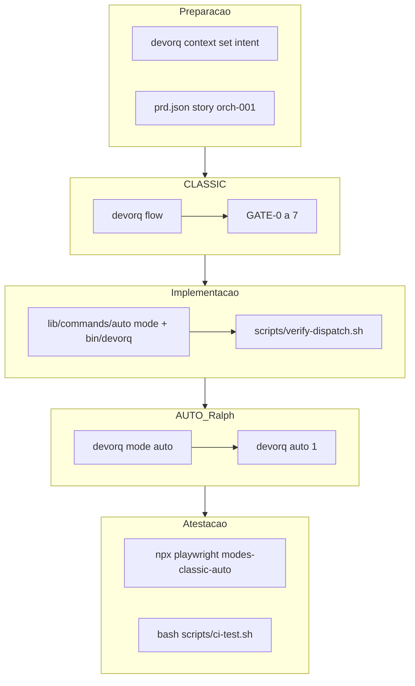

# Fluxo de implementação — Orquestrador DEVORQ (atestação orch-001)

**Story:** `orch-001` — Restaurar dispatch CLI v3.7  
**Modo:** CLASSIC (gates) + AUTO (Ralph) para verificação  
**Versão:** 3.7.0

---

## Objetivo

Usar o **próprio DEVORQ** para implementar e provar que CLASSIC e AUTO funcionam de ponta a ponta após a refatoração modular.

---

## Diagrama do fluxo executado



---

## Passo a passo (reproduzível)

### 1. Contexto e story

```bash
cd /path/to/devorq_v3
export DEVORQ_ROOT="$PWD" DEVORQ_DIR="$PWD"

# Intent no contexto (GATE-3)
# .devorq/state/context.json → intent, stack, orchestrator_flow

# Story em prd.json → orch-001 (pending)
```

### 2. CLASSIC — gates antes de implementar

```bash
devorq gate 1    # SPEC.md existe
devorq foundation validate   # GATE-0.5 (se foundation preenchido)
devorq flow "restaurar dispatch CLI v3.7"
```

**Critério CLASSIC:** gates 0→7 executam; vermelho = corrigir antes de marcar story done.

### 3. Implementação (escopo orch-001)

| Arquivo | Ação |
|---------|------|
| [bin/devorq](../bin/devorq) | Rotear `init`/`gate`→workflow, `compact`→context, `sync`/`vps`→integration |
| [lib/commands/auto.sh](../lib/commands/auto.sh) | Ralph default; `--guided`→lib/auto.sh |
| [lib/commands/mode.sh](../lib/commands/mode.sh) | mode-selector.sh |
| [lib/commands/review.sh](../lib/commands/review.sh) | skill code-review |
| [lib/commands/info.sh](../lib/commands/info.sh) | info ambiente |
| [lib/auto.sh](../lib/auto.sh) | `devorq::cmd_auto_guided` (híbrido) |
| [scripts/verify-dispatch.sh](../scripts/verify-dispatch.sh) | CI: sources existem |

### 4. Verificação dispatch

```bash
bash scripts/verify-dispatch.sh
```

### 5. AUTO — Ralph loop (story orch-001)

```bash
devorq mode auto          # → MODE=AUTO
devorq auto --help        # Ralph + --guided
printf '\n' | devorq auto 1   # 1 story, delegate simulado
```

**Nota:** sem `DEVORQ_DELEGATE_FN`, loop-auto simula delegate e roda check-story.

### 6. Marcar story (guided opcional)

```bash
# Após verify visual / testes:
devorq auto --guided --continue
# ou marcar manualmente passes=true em prd.json
```

### 7. Atestação E2E + CI

```bash
bash scripts/e2e-test.sh all
cd e2e-tests && npx playwright test tests/modes-classic-auto.spec.ts
bash scripts/ci-test.sh
```

### 8. Handoff

```bash
devorq compact
# → .devorq/state/handoff.json para próxima sessão
```

---

## Comportamento esperado por modo

| Comando | Modo | Saída esperada |
|---------|------|----------------|
| `devorq mode classic` | Seletor | `MODE=CLASSIC` |
| `devorq mode auto` | Seletor | `MODE=AUTO` |
| `devorq flow "…"` | CLASSIC | Gates 0–7, `Flow completo` |
| `devorq auto 1` | AUTO Ralph | `loop-auto`, `AUTO MODE COMPLETE` |
| `devorq auto --guided 1` | AUTO Híbrido | `[DEVORQ-AUTO]`, verify visual |
| `devorq init` | Workflow | `.devorq/` criado |

---

## Critérios de done (orch-001)

- [x] `scripts/verify-dispatch.sh` exit 0
- [x] `devorq init` / `mode` / `auto --help` exit 0
- [x] Playwright `modes-classic-auto` 8/8
- [x] `prd.json` story `orch-001` → `passes: true`, `status: done`

---

## Resultado da atestação (2026-05-22)

| Etapa | Comando | Resultado |
|-------|---------|-----------|
| Dispatch | `bash scripts/verify-dispatch.sh` | 22/22 módulos OK |
| CLASSIC | `devorq flow "atestar orquestrador orch-001"` | Flow completo (GATE-2 shellcheck warn) |
| AUTO Ralph | `devorq mode auto` + `devorq auto 1` | orch-001 verificada, 11/11 stories done |
| Playwright | `modes-classic-auto.spec.ts` | **8 passed** |
| CI | `bash scripts/ci-test.sh` | **43/43 passed** (incl. verify-dispatch) |
- [x] `bash scripts/e2e-test.sh all` — **11/11 passed**

### Correções aplicadas durante o fluxo

1. **`lib/helpers.sh`** — funções `devorq::info|log|warn|error|success` (estavam só stubadas nos unit tests).
2. **`scripts/verify-dispatch.sh`** — paths `lib/commands/` + smoke CLI.
3. **`scripts/ci-test.sh`** — gate `verify-dispatch.sh` na FASE 4.
4. **`.devorq/state/context.json`** — intent do wiring P0.
5. **`prd.json`** — story `orch-001` criada e concluída pelo loop AUTO.

### Como repetir

```bash
export DEVORQ_ROOT="$PWD" DEVORQ_DIR="$PWD"
bash scripts/verify-dispatch.sh
devorq mode classic && devorq flow "seu intent"
devorq mode auto && printf '\n' | devorq auto 1
cd e2e-tests && npx playwright test tests/modes-classic-auto.spec.ts
bash scripts/ci-test.sh
```

---

## Lições para o framework

1. **Refatorar bin sem wrappers = CLI quebrada** — gate de `verify-dispatch` no CI.
2. **AUTO Ralph ≠ AUTO guided** — um comando, duas flags explícitas.
3. **CLASSIC não substitui prd** — flow valida processo; auto consome stories.
